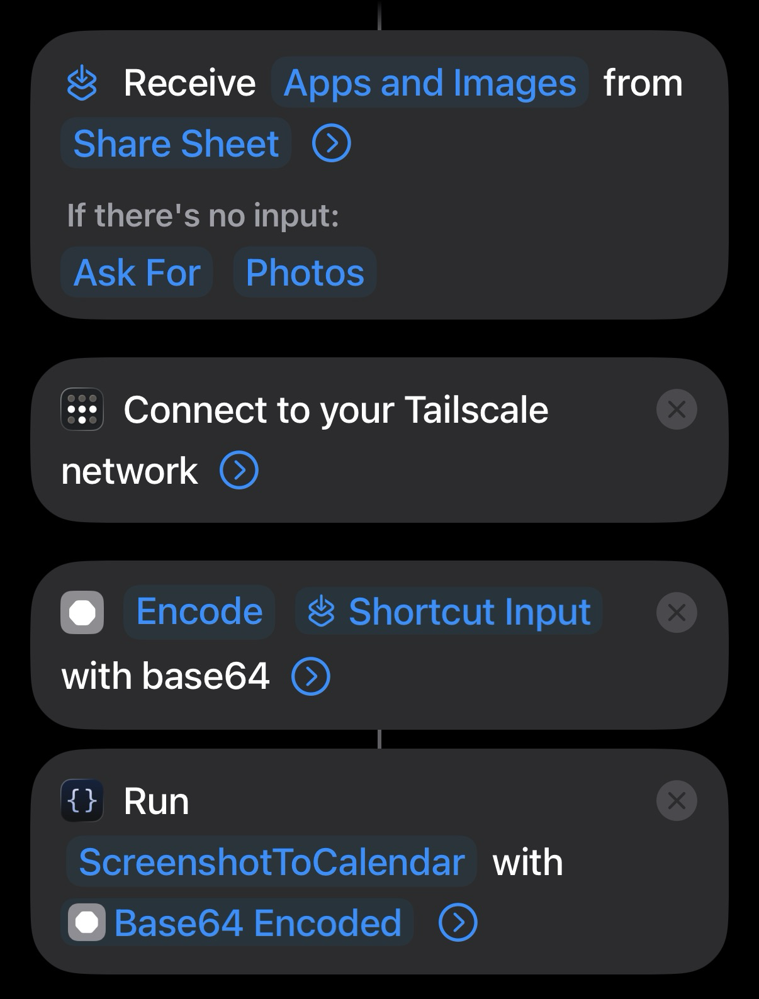

# screenshot-to-calendar

An automation pipeline that turns screenshots and photos of event posters, flyers, and Instagram posts into Google Calendar events.

Built to solve the universal habit of screenshotting things you want to do and then never acting on them.

## How it works

```
iPhone Share Sheet
  → iOS Shortcut (base64 encodes the image)
    → Scriptable (resizes image, POSTs to n8n webhook, shows result)
      → n8n Webhook (receives base64 image)
        → Claude Vision API (extracts structured event data as JSON)
          → Google Calendar (creates event with title, dates, venue, description)
            → Response back to Scriptable (confirmation alert with "Open in Calendar" option)
```

Share an event poster or Instagram post from your iPhone → tap "Capture Event" → a calendar event is created automatically.

## Requirements

- [n8n](https://n8n.io) — self-hosted via Docker
- [Docker Desktop](https://www.docker.com/products/docker-desktop/) — to run n8n
- [Tailscale](https://tailscale.com) — to expose n8n to your iPhone over a private network
- [Scriptable](https://scriptable.app) — iOS app to run the webhook script
- [Anthropic API key](https://console.anthropic.com) — for Claude Vision
- Google Calendar — via OAuth in n8n

## iOS Shortcut



## Setup

See [CLAUDE.md](CLAUDE.md#first-time-setup) for full setup instructions.

Quick start:

```bash
cp .env.example .env
# Fill in your values
make up      # start n8n
make push    # deploy the workflow
make deploy  # copy Scriptable script to iCloud
```

## Make targets

| Target | Description |
|--------|-------------|
| `make up` | Start n8n via Docker Compose |
| `make down` | Stop n8n |
| `make logs` | Tail n8n logs |
| `make deploy` | Copy `ScreenshotToCalendar.js` to Scriptable's iCloud folder |
| `make pull` | Fetch the live workflow from n8n and save to `screenshot-to-calendar-workflow.json` |
| `make push` | Deploy `screenshot-to-calendar-workflow.json` to n8n |

## Configuration

| Location | What's stored |
|----------|---------------|
| `.env` | n8n webhook URL, API key, workflow ID |
| Scriptable Keychain (iPhone) | n8n hostname (`n8n_host`) and port (`n8n_port`, default `5678`) |
| n8n credential store | Anthropic API key, Google Calendar OAuth tokens |
